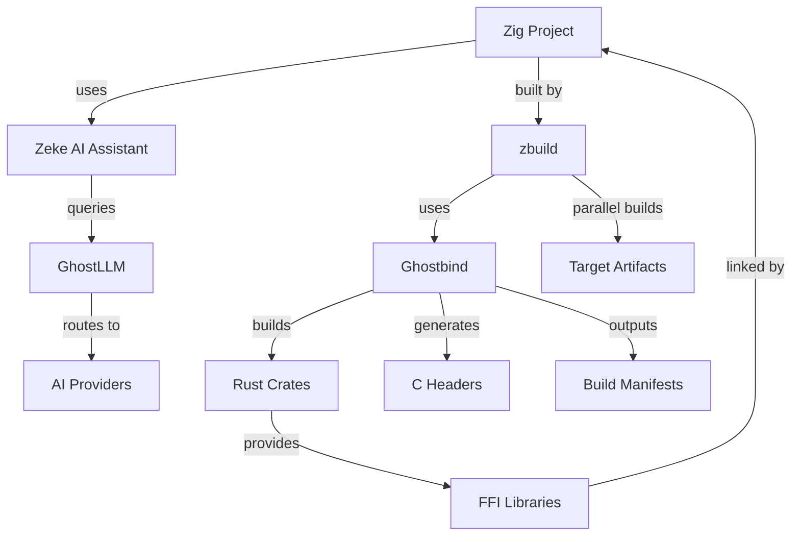

# Integration Overview: Zig ↔ Rust Ecosystem

<div align="center">
  

  ## The Complete Integration Guide

  **Zeke** (Zig) ↔ **zbuild** (Zig) ↔ **Ghostbind** (Rust) ↔ **GhostLLM** (Rust)

  *Seamless cross-language development with AI-powered tooling*
</div>

## Table of Contents

1. [Ecosystem Overview](#ecosystem-overview)
2. [Project Roles & Relationships](#project-roles--relationships)
3. [Integration Architecture](#integration-architecture)
4. [Zig Projects Leveraging Rust](#zig-projects-leveraging-rust)
5. [Rust Projects Leveraging Zig](#rust-projects-leveraging-zig)
6. [Cross-Language Build Patterns](#cross-language-build-patterns)
7. [AI-Powered Development Workflow](#ai-powered-development-workflow)
8. [Real-World Integration Examples](#real-world-integration-examples)
9. [Best Practices & Guidelines](#best-practices--guidelines)
10. [Performance Considerations](#performance-considerations)

## Ecosystem Overview

The Ghost ecosystem creates a unified development environment where Zig and Rust projects seamlessly interoperate, enhanced by AI-powered development tools:

```
┌─────────────────────────────────────────────────────────────┐
│                    Ghost Ecosystem                          │
├─────────────────────────────────────────────────────────────┤
│  Zeke (Zig)     │  zbuild (Zig)   │  Ghostbind (Rust)      │
│  AI Copilot     │  Build System   │  FFI Bridge           │
│                 │                 │                        │
│  • Multi-AI     │  • Cross-comp   │  • Target mapping     │
│  • CLI/TUI      │  • Rust integ   │  • Cargo integration  │
│  • Neovim       │  • Parallel     │  • Header generation  │
│  • Code assist  │  • Caching      │  • Artifact discovery │
└─────────────────┴─────────────────┴────────────────────────┘
                            │
                            ▼
                   ┌─────────────────┐
                   │  GhostLLM       │
                   │  (Rust)         │
                   │                 │
                   │  • AI Proxy     │
                   │  • Multi-provider│
                   │  • Enterprise   │
                   │  • WebSocket    │
                   └─────────────────┘
```

## Project Roles & Relationships

### 🦎 **Zeke** - AI-Powered Zig Development 
- https://github.com/ghostkellz/zeke 
- Zig projects leverage with zig fetch --save <URL> and use archive main refs URL
- **Language**: Zig
- **Role**: AI development companion and copilot
- **Key Features**:
  - Multi-backend AI support (GitHub Copilot, OpenAI, Claude, Ollama)
  - Native Zig async runtime for high-performance AI requests
  - Neovim integration with inline and panel chat
  - CLI/TUI interfaces for terminal-based development
  - Live model switching and code assistance

### 🔧 **zbuild** - Universal Build Orchestrator 
- https://github.com/ghostkellz/zbuild
- Zig projects leverage with zig fetch --save <URL> and use archive main refs URL 
- **Language**: Zig
- **Role**: Modern build system written in Zig for cross-language projects
- **Key Features**:
  - Native Zig build system with advanced orchestration
  - Cross-compilation for multiple targets
  - Rust crate integration within Zig builds
  - Parallel build execution and intelligent caching
  - Dependency management and artifact discovery

### 👻 **Ghostbind** - FFI Bridge
https://github.com/ghostkellz/ghostbind
- **Language**: Rust
- **Role**: FFI bridge enabling Zig ↔ Rust interoperability
- **Key Features**:
  - Automatic target mapping (Zig ↔ Rust)
  - Cargo integration and crate building
  - C header generation via cbindgen
  - Build manifest generation for tooling integration
  - Cross-platform artifact discovery

### 🤖 **GhostLLM** - AI Infrastructure
https://github.com/ghostkellz/ghostllm
- **Language**: Rust
- **Role**: Enterprise AI proxy and model router
- **Key Features**:
  - Unified API for multiple AI providers
  - Enterprise-grade rate limiting and API management
  - WebSocket streaming and function calling
  - Containerized deployment support
  - Performance-optimized AI request routing

## Integration Architecture

### Core Integration Flow



### Data Flow Architecture

```
Zig Source Code
      ↓
   ┌─────────────────┐
   │ Zeke Analysis   │ ← AI-powered code understanding
   │ • Code context  │
   │ • Suggestions   │
   │ • Error fixes   │
   └─────────────────┘
      ↓
   ┌─────────────────┐
   │ zbuild          │ ← Build orchestration
   │ • Target detect │
   │ • Dep resolution│
   │ • Parallel exec │
   └─────────────────┘
      ↓
   ┌─────────────────┐
   │ Ghostbind       │ ← FFI bridge
   │ • Target map    │
   │ • Cargo build   │
   │ • Header gen    │
   └─────────────────┘
      ↓
   ┌─────────────────┐
   │ Rust Crates     │ ← Implementation
   │ • Business logic│
   │ • Performance   │
   │ • Ecosystem     │
   └─────────────────┘
      ↓
   Final Zig Binary
```

## Zig Projects Leveraging Rust

### 1. Basic Rust Crate Integration

**Project Structure:**
```
my-zig-app/
├── build.zig               # Zig build configuration
├── zbuild.json            # zbuild configuration
├── src/
│   ├── main.zig           # Zig application entry
│   └── rust_interface.zig # Rust FFI bindings
├── rust_libs/
│   ├── core/              # Rust business logic
│   │   ├── Cargo.toml
│   │   └── src/lib.rs
│   └── math/              # Rust math library
│       ├── Cargo.toml
│       └── src/lib.rs
└── .ghostbind/
    ├── cache/             # Generated artifacts
    └── manifests/         # Build metadata
```

**zbuild.json Configuration:**
```json
{
  "project": {
    "name": "my-zig-app",
    "version": "0.1.0",
    "target": "x86_64-linux-gnu"
  },
  "dependencies": {
    "rust_crates": [
      {
        "name": "core",
        "path": "rust_libs/core",
        "features": ["async", "serde"],
        "crate_type": "staticlib"
      },
      {
        "name": "math",
        "path": "rust_libs/math",
        "features": ["simd"],
        "crate_type": "cdylib"
      }
    ]
  },
  "build": {
    "optimization": "ReleaseFast",
    "strip": false,
    "cross_compile": true
  }
}
```

**Zig Build Integration:**
```zig
// build.zig
const std = @import("std");

pub fn build(b: *std.Build) !void {
    const target = b.standardTargetOptions(.{});
    const optimize = b.standardOptimizeOption(.{});

    // Create executable
    const exe = b.addExecutable(.{
        .name = "my-zig-app",
        .root_source_file = .{ .path = "src/main.zig" },
        .target = target,
        .optimize = optimize,
    });

    // Use ghostbind to build Rust dependencies
    const ghostbind_step = b.addSystemCommand(&[_][]const u8{
        "ghostbind", "build",
        "--manifest-path", "rust_libs/core/Cargo.toml",
        "--zig-target", @tagName(target.result.cpu.arch),
    });

    // Link the generated Rust libraries
    exe.linkLibrary(b.dependency("rust_core", .{}));
    exe.addLibraryPath(.{ .path = ".ghostbind/cache/target/release" });
    exe.addIncludePath(.{ .path = ".ghostbind/cache/headers" });

    exe.step.dependOn(&ghostbind_step.step);

    // Install step
    b.installArtifact(exe);

    // Run step
    const run_cmd = b.addRunArtifact(exe);
    const run_step = b.step("run", "Run the app");
    run_step.dependOn(&run_cmd.step);
}
```

**Zig FFI Interface:**
```zig
// src/rust_interface.zig
const std = @import("std");

// Import generated C headers
const c = @cImport({
    @cInclude("core.h");
    @cInclude("math.h");
});

pub const RustCore = struct {
    handle: *c.CoreHandle,

    pub fn init(allocator: std.mem.Allocator, config: []const u8) !RustCore {
        const config_z = try allocator.dupeZ(u8, config);
        defer allocator.free(config_z);

        const handle = c.core_create(config_z.ptr) orelse return error.InitFailed;
        return RustCore{ .handle = handle };
    }

    pub fn deinit(self: *RustCore) void {
        c.core_destroy(self.handle);
    }

    pub fn process(self: *RustCore, allocator: std.mem.Allocator, data: []const u8) ![]const u8 {
        const result = c.core_process(self.handle, data.ptr, data.len);
        if (result == null) return error.ProcessFailed;

        defer c.core_free_string(result);
        const result_str = std.mem.span(result);
        return try allocator.dupe(u8, result_str);
    }
};

pub const RustMath = struct {
    pub fn vectorAdd(a: []const f32, b: []const f32, result: []f32) !void {
        if (a.len != b.len or a.len != result.len) return error.SizeMismatch;

        const success = c.math_vector_add(a.ptr, b.ptr, result.ptr, a.len);
        if (!success) return error.MathError;
    }

    pub fn matrixMultiply(a: []const f32, b: []const f32, result: []f32,
                         rows: usize, cols: usize) !void {
        const success = c.math_matrix_multiply(a.ptr, b.ptr, result.ptr, rows, cols);
        if (!success) return error.MatrixError;
    }
};
```

**Main Application:**
```zig
// src/main.zig
const std = @import("std");
const rust = @import("rust_interface.zig");

pub fn main() !void {
    var gpa = std.heap.GeneralPurposeAllocator(.{}){};
    defer _ = gpa.deinit();
    const allocator = gpa.allocator();

    // Initialize Rust core
    var core = try rust.RustCore.init(allocator,
        \\{"mode": "production", "threads": 4}
    );
    defer core.deinit();

    // Use Rust math functions
    const a = [_]f32{ 1.0, 2.0, 3.0, 4.0 };
    const b = [_]f32{ 5.0, 6.0, 7.0, 8.0 };
    var result = [_]f32{ 0.0, 0.0, 0.0, 0.0 };

    try rust.RustMath.vectorAdd(&a, &b, &result);
    std.debug.print("Vector addition result: {any}\n", .{result});

    // Process data with Rust core
    const processed = try core.process(allocator, "Hello from Zig!");
    defer allocator.free(processed);
    std.debug.print("Processed: {s}\n", .{processed});
}
```

### 2. AI-Enhanced Development with Zeke

**Zeke Integration:**
```bash
# AI-powered code generation
zeke generate --lang=zig --integrate-rust \
  "Create a high-performance image processor using Rust for pixel operations"

# Code explanation and optimization
zeke explain --file=src/main.zig --context=rust-integration

# Automated testing generation
zeke test --generate --ffi-safety --rust-integration
```

**AI-Enhanced Build Process:**
```zig
// AI-suggested optimizations in build.zig
pub fn build(b: *std.Build) !void {
    // Zeke recommendation: Use conditional compilation for different targets
    const is_native = b.option(bool, "native", "Build for native CPU") orelse false;

    if (is_native) {
        // AI-optimized native build
        exe.target.cpu_arch = std.Target.current.cpu.arch;
        exe.target.cpu_model = .native;
    }

    // Zeke-generated error handling
    const rust_build_failed = b.step("rust-fallback", "Fallback if Rust build fails");
    rust_build_failed.dependOn(&fallback_cmd.step);
}
```

## Rust Projects Leveraging Zig

### 1. Zig Performance Modules in Rust

**Project Structure:**
```
my-rust-app/
├── Cargo.toml
├── build.rs               # Custom build script
├── src/
│   ├── lib.rs            # Rust library
│   └── zig_bindings.rs   # Zig FFI bindings
├── zig_modules/
│   ├── algorithms/       # High-performance Zig algorithms
│   │   ├── build.zig
│   │   └── src/sort.zig
│   └── simd/            # SIMD operations in Zig
│       ├── build.zig
│       └── src/vector.zig
└── cbindgen.toml         # For reverse FFI (Rust → Zig)
```

**Cargo.toml with Zig Integration:**
```toml
[package]
name = "my-rust-app"
version = "0.1.0"
edition = "2021"
build = "build.rs"

[dependencies]
libc = "0.2"

[build-dependencies]
bindgen = "0.69"

[features]
default = ["zig-simd"]
zig-simd = []
zig-algorithms = []
```

**Build Script (build.rs):**
```rust
use std::env;
use std::path::PathBuf;
use std::process::Command;

fn main() {
    // Build Zig modules using zbuild
    let output = Command::new("zbuild")
        .args(&[
            "build",
            "--config", "zig_modules/algorithms/zbuild.json",
            "--target", &get_rust_target(),
            "--output-dir", "target/zig",
        ])
        .output()
        .expect("Failed to execute zbuild");

    if !output.status.success() {
        panic!("zbuild failed: {}", String::from_utf8_lossy(&output.stderr));
    }

    // Link Zig libraries
    println!("cargo:rustc-link-search=native=target/zig");
    println!("cargo:rustc-link-lib=static=algorithms");
    println!("cargo:rustc-link-lib=static=simd");

    // Generate bindings for Zig functions
    let bindings = bindgen::Builder::default()
        .header("target/zig/include/algorithms.h")
        .header("target/zig/include/simd.h")
        .parse_callbacks(Box::new(bindgen::CargoCallbacks))
        .generate()
        .expect("Unable to generate bindings");

    let out_path = PathBuf::from(env::var("OUT_DIR").unwrap());
    bindings
        .write_to_file(out_path.join("zig_bindings.rs"))
        .expect("Couldn't write bindings!");
}

fn get_rust_target() -> String {
    env::var("TARGET").unwrap_or_else(|_| "native".to_string())
}
```

**Rust-Zig Interface:**
```rust
// src/zig_bindings.rs
#![allow(non_upper_case_globals)]
#![allow(non_camel_case_types)]
#![allow(non_snake_case)]

include!(concat!(env!("OUT_DIR"), "/zig_bindings.rs"));

use std::ffi::c_void;

pub struct ZigSorter {
    ctx: *mut c_void,
}

impl ZigSorter {
    pub fn new(algorithm: SortAlgorithm) -> Result<Self, &'static str> {
        let ctx = unsafe { zig_sorter_create(algorithm as u32) };
        if ctx.is_null() {
            Err("Failed to create Zig sorter")
        } else {
            Ok(ZigSorter { ctx })
        }
    }

    pub fn sort_i32(&self, data: &mut [i32]) -> Result<(), &'static str> {
        let success = unsafe {
            zig_sort_i32(self.ctx, data.as_mut_ptr(), data.len())
        };
        if success {
            Ok(())
        } else {
            Err("Sort operation failed")
        }
    }

    pub fn sort_f64(&self, data: &mut [f64]) -> Result<(), &'static str> {
        let success = unsafe {
            zig_sort_f64(self.ctx, data.as_mut_ptr(), data.len())
        };
        if success {
            Ok(())
        } else {
            Err("Sort operation failed")
        }
    }
}

impl Drop for ZigSorter {
    fn drop(&mut self) {
        unsafe {
            zig_sorter_destroy(self.ctx);
        }
    }
}

#[repr(u32)]
pub enum SortAlgorithm {
    QuickSort = 0,
    MergeSort = 1,
    RadixSort = 2,
    NetworkSort = 3,
}
```

**High-Performance Zig Module:**
```zig
// zig_modules/algorithms/src/sort.zig
const std = @import("std");
const builtin = @import("builtin");

export fn zig_sorter_create(algorithm: u32) ?*anyopaque {
    const allocator = std.heap.c_allocator;
    const sorter = allocator.create(Sorter) catch return null;
    sorter.* = Sorter{
        .algorithm = @enumFromInt(algorithm),
        .allocator = allocator,
    };
    return @ptrCast(sorter);
}

export fn zig_sorter_destroy(ctx: ?*anyopaque) void {
    if (ctx) |ptr| {
        const sorter: *Sorter = @ptrCast(@alignCast(ptr));
        sorter.allocator.destroy(sorter);
    }
}

export fn zig_sort_i32(ctx: ?*anyopaque, data: [*]i32, len: usize) bool {
    const sorter: *Sorter = @ptrCast(@alignCast(ctx orelse return false));
    const slice = data[0..len];

    switch (sorter.algorithm) {
        .QuickSort => quickSort(i32, slice),
        .MergeSort => mergeSort(i32, slice, sorter.allocator) catch return false,
        .RadixSort => radixSort(i32, slice, sorter.allocator) catch return false,
        .NetworkSort => networkSort(i32, slice),
    }
    return true;
}

const SortAlgorithm = enum(u32) {
    QuickSort = 0,
    MergeSort = 1,
    RadixSort = 2,
    NetworkSort = 3,
};

const Sorter = struct {
    algorithm: SortAlgorithm,
    allocator: std.mem.Allocator,
};

// Optimized Zig sorting implementations
fn quickSort(comptime T: type, items: []T) void {
    if (items.len < 2) return;

    // Highly optimized quicksort with Zig's compile-time optimizations
    const pivot_index = partition(T, items);
    quickSort(T, items[0..pivot_index]);
    quickSort(T, items[pivot_index + 1..]);
}

fn networkSort(comptime T: type, items: []T) void {
    // SIMD-optimized sorting network for small arrays
    if (builtin.target.cpu.arch.endian() == .Little) {
        // Platform-specific optimizations
        sortingNetworkSIMD(T, items);
    } else {
        std.sort.insertion(T, items, {}, comptime std.sort.asc(T));
    }
}
```

### 2. GhostLLM Integration with Zig Components

**AI-Enhanced Rust Service:**
```rust
// src/ai_service.rs
use crate::zig_bindings::*;

pub struct AIProcessor {
    zig_vectorizer: ZigVectorizer,
    rust_llm_client: GhostLLMClient,
}

impl AIProcessor {
    pub async fn process_prompt(&self, prompt: &str) -> Result<String, ProcessError> {
        // Use Zig for high-performance text preprocessing
        let embeddings = self.zig_vectorizer.embed_text(prompt)?;

        // Use Rust/GhostLLM for AI model interaction
        let response = self.rust_llm_client
            .complete_chat(&embeddings, prompt)
            .await?;

        // Post-process with Zig for performance-critical operations
        let optimized_response = self.zig_vectorizer.optimize_output(&response)?;

        Ok(optimized_response)
    }
}
```

## Cross-Language Build Patterns

### 1. Unified Build Configuration

**Global zbuild.json:**
```json
{
  "workspace": {
    "name": "ghost-ecosystem-project",
    "version": "1.0.0",
    "members": [
      "apps/zig-frontend",
      "services/rust-backend",
      "libs/shared-core"
    ]
  },
  "targets": {
    "development": {
      "zig_target": "native",
      "rust_target": "x86_64-unknown-linux-gnu",
      "optimization": "Debug",
      "features": ["dev-tools", "hot-reload"]
    },
    "production": {
      "zig_target": "x86_64-linux-gnu",
      "rust_target": "x86_64-unknown-linux-gnu",
      "optimization": "ReleaseFast",
      "features": ["optimized", "telemetry"]
    },
    "embedded": {
      "zig_target": "arm-linux-gnueabihf",
      "rust_target": "arm-unknown-linux-gnueabihf",
      "optimization": "ReleaseSmall",
      "features": ["no-std", "embedded"]
    }
  },
  "integration": {
    "ghostbind": {
      "auto_headers": true,
      "cache_artifacts": true,
      "parallel_builds": true
    },
    "zeke": {
      "ai_assistance": true,
      "auto_optimize": true,
      "code_suggestions": true
    }
  }
}
```

### 2. Cross-Compilation Pipeline

```bash
#!/bin/bash
# build-all-targets.sh

set -e

TARGETS=("development" "production" "embedded")
PROJECTS=("zig-frontend" "rust-backend")

echo "🚀 Starting Ghost Ecosystem Build Pipeline"

for target in "${TARGETS[@]}"; do
    echo "📦 Building for target: $target"

    for project in "${PROJECTS[@]}"; do
        echo "  🔧 Building $project"

        # Use zbuild for orchestration
        zbuild build \
            --project "$project" \
            --target "$target" \
            --parallel \
            --cache

        # Use ghostbind for FFI artifacts
        ghostbind build \
            --manifest-path "$project/Cargo.toml" \
            --target-config "targets.$target" \
            --output-dir "dist/$target/$project"
    done

    echo "  ✅ Target $target completed"
done

echo "🎉 All targets built successfully!"
```

### 3. AI-Assisted Development Workflow

```bash
#!/bin/bash
# ai-dev-workflow.sh

# Start AI development session
echo "🤖 Initializing AI-enhanced development environment"

# Zeke AI analysis
zeke analyze --project . --output-format json > analysis.json

# AI-powered code review
zeke review \
    --files "$(git diff --name-only)" \
    --context rust-zig-integration \
    --suggest-optimizations

# Auto-generate tests for FFI boundaries
zeke generate-tests \
    --ffi-focus \
    --memory-safety \
    --cross-language \
    --output tests/generated/

# AI-powered documentation
zeke document \
    --api-boundaries \
    --integration-patterns \
    --output docs/ai-generated/

echo "🎯 AI workflow complete - ready for development!"
```

## AI-Powered Development Workflow

### 1. Intelligent Code Generation

**Zeke-Powered Development:**
```bash
# Generate Rust FFI wrapper for existing Zig code
zeke generate ffi-wrapper \
    --source src/algorithms.zig \
    --target rust \
    --safety-checks \
    --memory-management

# AI-optimized build configuration
zeke optimize build-config \
    --profile production \
    --target-analysis \
    --dependency-graph

# Cross-language refactoring suggestions
zeke refactor suggest \
    --lang-boundary rust-zig \
    --performance-focus \
    --safety-improvements
```

### 2. GhostLLM Integration for Team Development

**AI-Enhanced Code Review:**
```rust
// Integration with GhostLLM for intelligent code analysis
pub struct AICodeReviewer {
    llm_client: GhostLLMClient,
}

impl AICodeReviewer {
    pub async fn review_ffi_boundary(&self,
        zig_code: &str,
        rust_code: &str
    ) -> ReviewResult {
        let prompt = format!(
            "Review this FFI integration for safety and performance:\n\
             Zig code:\n{}\n\n\
             Rust code:\n{}\n\n\
             Focus on memory safety, error handling, and optimization opportunities.",
            zig_code, rust_code
        );

        let review = self.llm_client
            .analyze_code(&prompt)
            .await?;

        ReviewResult::from_ai_analysis(review)
    }
}
```

## Real-World Integration Examples

### 1. High-Performance Game Engine

```
game-engine/
├── core/                    # Zig game loop & rendering
│   ├── src/main.zig
│   ├── src/renderer.zig
│   └── zbuild.json
├── physics/                 # Rust physics simulation
│   ├── Cargo.toml
│   ├── src/lib.rs          # High-level physics API
│   └── src/ffi.rs          # FFI exports for Zig
├── ai/                     # Rust AI/ML components
│   ├── Cargo.toml
│   └── src/lib.rs
└── tools/
    ├── editor/             # Zig-based level editor
    └── pipeline/           # Rust asset pipeline
```

**Performance Distribution:**
- **Zig Components**: Game loop, rendering, memory management (speed-critical)
- **Rust Components**: Physics, AI, networking (safety-critical)
- **Integration**: Zero-copy data exchange, shared memory pools

### 2. Embedded Systems with AI

```
iot-device/
├── firmware/               # Zig bare-metal firmware
│   ├── src/main.zig
│   ├── src/drivers/
│   └── build.zig
├── ai-inference/          # Rust AI inference engine
│   ├── Cargo.toml
│   ├── src/lib.rs
│   └── models/
├── cloud-connector/       # Rust cloud integration
│   ├── Cargo.toml
│   └── src/lib.rs
└── monitoring/           # Real-time telemetry
    ├── zig-collector/    # High-frequency data collection
    └── rust-analyzer/    # Complex data analysis
```

### 3. Financial Trading System

```
trading-system/
├── execution-engine/       # Zig ultra-low latency
│   ├── src/main.zig
│   ├── src/orderbook.zig
│   └── src/matching.zig
├── risk-management/       # Rust safety-critical
│   ├── Cargo.toml
│   └── src/lib.rs
├── market-data/          # Hybrid processing
│   ├── zig-parser/       # High-speed parsing
│   └── rust-analytics/   # Complex calculations
└── ai-trading/          # AI-powered strategies
    ├── zeke-assistant/   # Development AI
    ├── ghostllm-proxy/   # Model serving
    └── rust-strategies/  # Trading algorithms
```

## Best Practices & Guidelines

### 1. Memory Management Across Languages

**Safe Patterns:**
```rust
// Rust side - clear ownership
#[no_mangle]
pub extern "C" fn create_processor() -> *mut Processor {
    Box::into_raw(Box::new(Processor::new()))
}

#[no_mangle]
pub extern "C" fn destroy_processor(ptr: *mut Processor) {
    if !ptr.is_null() {
        unsafe { let _ = Box::from_raw(ptr); }
    }
}
```

```zig
// Zig side - RAII wrapper
const Processor = struct {
    ptr: *c.Processor,

    pub fn init() !Processor {
        const ptr = c.create_processor() orelse return error.InitFailed;
        return Processor{ .ptr = ptr };
    }

    pub fn deinit(self: *Processor) void {
        c.destroy_processor(self.ptr);
    }
};
```

### 2. Error Handling Strategies

**Unified Error Handling:**
```rust
// Rust error definitions
#[repr(C)]
pub enum ErrorCode {
    Success = 0,
    InvalidInput = 1,
    OutOfMemory = 2,
    IoError = 3,
    NetworkError = 4,
}

#[repr(C)]
pub struct Result {
    error_code: ErrorCode,
    data: *mut c_void,
    message: *const c_char,
}
```

```zig
// Zig error handling
const FFIError = error{
    InvalidInput,
    OutOfMemory,
    IoError,
    NetworkError,
};

fn mapCError(error_code: c.ErrorCode) FFIError!void {
    return switch (error_code) {
        c.ErrorCode.Success => {},
        c.ErrorCode.InvalidInput => FFIError.InvalidInput,
        c.ErrorCode.OutOfMemory => FFIError.OutOfMemory,
        c.ErrorCode.IoError => FFIError.IoError,
        c.ErrorCode.NetworkError => FFIError.NetworkError,
    };
}
```

### 3. Performance Optimization Guidelines

**Data Layout Optimization:**
```rust
// Rust - cache-friendly structures
#[repr(C)]
pub struct Vector3 {
    x: f32,
    y: f32,
    z: f32,
    _padding: f32, // Align to 16 bytes for SIMD
}

#[repr(C)]
pub struct Transform {
    position: Vector3,
    rotation: Vector3,
    scale: Vector3,
    _padding: f32,
}
```

```zig
// Zig - matching layout with compile-time verification
const Vector3 = extern struct {
    x: f32,
    y: f32,
    z: f32,
    _padding: f32,

    comptime {
        std.debug.assert(@sizeOf(Vector3) == 16);
        std.debug.assert(@alignOf(Vector3) == 4);
    }
};
```

## Performance Considerations

### 1. Zero-Copy Data Exchange

```rust
// Rust side - view into Zig memory
#[no_mangle]
pub extern "C" fn process_slice_in_place(
    data: *mut f32,
    len: usize,
) -> bool {
    let slice = unsafe { std::slice::from_raw_parts_mut(data, len) };

    // Process without copying
    slice.iter_mut().for_each(|x| *x *= 2.0);
    true
}
```

```zig
// Zig side - pass reference directly
fn processData(data: []f32) !void {
    const success = c.process_slice_in_place(data.ptr, data.len);
    if (!success) return error.ProcessingFailed;
}
```

### 2. Batch Operations for Efficiency

```rust
// Process multiple items to amortize FFI overhead
#[no_mangle]
pub extern "C" fn batch_transform(
    transforms: *const Transform,
    matrices: *mut Matrix4,
    count: usize,
) -> bool {
    let input = unsafe { std::slice::from_raw_parts(transforms, count) };
    let output = unsafe { std::slice::from_raw_parts_mut(matrices, count) };

    // SIMD-optimized batch processing
    for (transform, matrix) in input.iter().zip(output.iter_mut()) {
        *matrix = transform.to_matrix();
    }
    true
}
```

### 3. Asynchronous Integration Patterns

```rust
// Rust async runtime for I/O heavy operations
static RUNTIME: Lazy<Runtime> = Lazy::new(|| {
    Runtime::new().expect("Failed to create async runtime")
});

#[no_mangle]
pub extern "C" fn async_fetch_data(
    url: *const c_char,
    callback: extern "C" fn(*const c_char, *mut c_void),
    user_data: *mut c_void,
) {
    let url_str = unsafe { CStr::from_ptr(url) }.to_str().unwrap();
    let url_owned = url_str.to_owned();

    RUNTIME.spawn(async move {
        match fetch_data(&url_owned).await {
            Ok(data) => {
                let c_data = CString::new(data).unwrap();
                callback(c_data.as_ptr(), user_data);
            }
            Err(_) => callback(std::ptr::null(), user_data),
        }
    });
}
```

---

## Conclusion

The Ghost ecosystem provides a comprehensive solution for seamless Zig-Rust integration, enhanced by AI-powered development tools. By leveraging each language's strengths—Zig's performance and low-level control, Rust's safety and ecosystem—developers can build robust, high-performance applications while maintaining safety and productivity.

The integration of Zeke (AI assistant), zbuild (build orchestration), Ghostbind (FFI bridge), and GhostLLM (AI infrastructure) creates a unified development environment where cross-language development becomes as natural as working within a single language ecosystem.

**Key Benefits:**
- ⚡ **Performance**: Zig for speed-critical code, Rust for robust business logic
- 🛡️ **Safety**: Memory safety guarantees across language boundaries
- 🤖 **AI-Enhanced**: Intelligent code generation, optimization, and assistance
- 🔧 **Tooling**: Seamless build orchestration and dependency management
- 🌍 **Cross-Platform**: Unified target support across all major platforms

This integration pattern enables teams to leverage the best of both languages while maintaining a cohesive, productive development experience.
