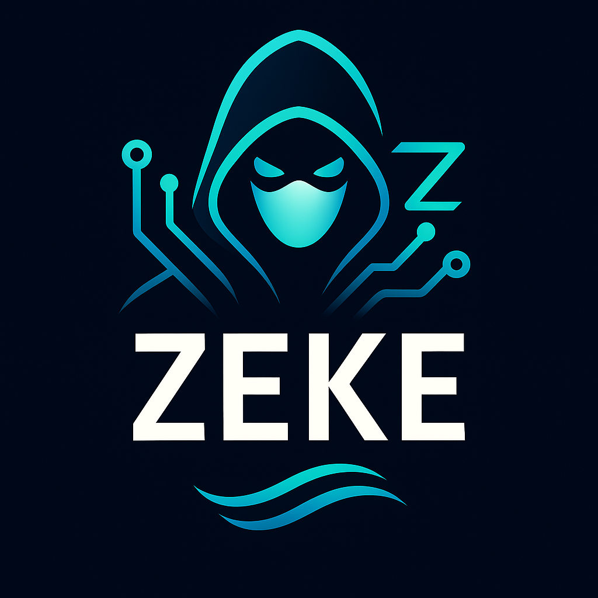

<div align="center">
  
</div>

# ⚡ ZEKE - The Rust-Native AI Dev Companion

---

### The Next-Gen AI Copilot for Neovim and CLI

ZEKE brings lightning-fast, native Rust performance to AI-powered coding workflows, integrating:

* **GitHub Copilot** (chat, inline, code actions)
* **OpenAI** (GPT-4, GPT-4o, GPT-3.5)
* **Anthropic Claude** (3.5, 4, Pro via Google sign-in)
* **Ollama/local LLMs** (optional)
* **Google Gemini** 
* **LiteLLM integration AI proxy functionality** 
* **More soon!**

**Authenticate with GitHub, Google, OpenAI. Switch models live.**
Accept completions, chat, run `/explain`, `/fix`, and more—all inside Neovim or your terminal.

**Leverage existing language models and services like github copilot pro and quickly switch between models just like vscode + github copilot extension **

---

## ✨ Features

* ⚡ **Rust 2024 Edition, Async-First:** Written entirely in Rust for pure speed and memory safety
* 🔥 **Tokio Runtime:** True non-blocking async calls and parallel AI requests
* 🤖 **Multi-Backend:** Seamlessly use Copilot, ChatGPT, Claude, local LLMs
* 📝 **Chat + Actions:** Panel chat, inline, batch code actions, `/explain` & `/test` commands
* 🔑 **Auth:** Sign in with GitHub (Copilot), Google (Claude), OpenAI keys—configurable
* 🖥️ **Dev Focus:** Refactor, doc, review, batch ops—no cloud lock-in, all from Nvim & CLI
* 🔌 **Extensible:** CLI, TUI, and plugin API for automation, batch, and scripting

---

## 📚 Library Usage (For GhostFlow Integration)

Zeke can be used as a library for integration into other Rust projects:

```toml
# Cargo.toml
[dependencies]
zeke = { git = "https://github.com/ghostkellz/zeke", features = ["git"] }
```

```rust
use zeke::{ZekeApi, ZekeResult};

#[tokio::main]
async fn main() -> ZekeResult<()> {
    // Initialize the API
    let api = ZekeApi::new().await?;

    // Ask a coding question
    let response = api.ask("claude", "Explain this Rust function", None).await?;
    println!("AI Response: {}", response.content);

    // List available providers
    let providers = api.list_providers().await?;
    for provider in providers {
        println!("Provider: {} ({})", provider.name, provider.status);
    }

    // Git operations (when git feature is enabled)
    #[cfg(feature = "git")]
    {
        let git = api.git()?;
        let status = git.status().await?;
        println!("Git branch: {}", status.branch);
    }

    Ok(())
}
```

---

## 📦 Quick Start

> **Requirements:**
>
> * Rust 1.70+
> * Neovim 0.9+
> * AI provider accounts

```sh
git clone https://github.com/ghostkellz/zeke.git
cd zeke
cargo build --release
nvim
# Run :Zeke to launch the AI panel
```

**Or use your favorite plugin manager:**

```lua
-- Packer.nvim example
use { 'ghostkellz/zeke', run = 'cargo build --release' }
```

---

## 🛠️ Keybindings (Default)

| Action                                    | Command / Keybinding   |
| ----------------------------------------- | ---------------------- |
| Open Zeke panel                           | `<leader>ac` / `:Zeke` |
| Accept suggestion                         | `<C-g>` / `<C-l>`      |
| Next/Prev suggestion                      | `<C-]>` / `<C-[>`      |
| Dismiss                                   | `<C-\\>`               |
| Open AI palette                           | `<leader>ai`           |
| Toggle inline AI                          | `<leader>at`           |
| Remap in `init.lua`/`zeke.toml` as needed |                        |

---

## 🔒 Auth Setup

* **Copilot:** `export GITHUB_TOKEN=ghp_xxx` (or sign in from panel)
* **Claude:** Google sign-in in the panel
* **OpenAI:** `export OPENAI_API_KEY=sk-xxx`
* **Ollama/local:** Set endpoint in `zeke.toml`

---

## 🌐 Model Switching (On the Fly)

Switch between AI providers and models live:

* `/model copilot`
* `/model gpt-4`
* `/model claude-4`
* `/model local`

---

## ⚡ Example Usage

* `:Zeke` — Open the chat panel
* `<leader>ac` — Accept code completion
* `:Zeke explain` — Ask for code explanation
* `:Zeke test` — Ask for test cases
* `/model claude-3.5` — Change AI backend live

---

## 💡 Roadmap

* Project/file search and edit
* Claude Code CLI in your terminal
* Full zsh/bash AI autocomplete
* Multi-file refactor and review
* Plugin API for advanced automation

---

## 🤝 Contributing

PRs, issues, ideas, and flames welcome!
See [`CONTRIBUTING.md`](CONTRIBUTING.md) for style and Rust patterns.

---

## 👻 Built with paranoia and joy by [GhostKellz](https://github.com/ghostkellz)

